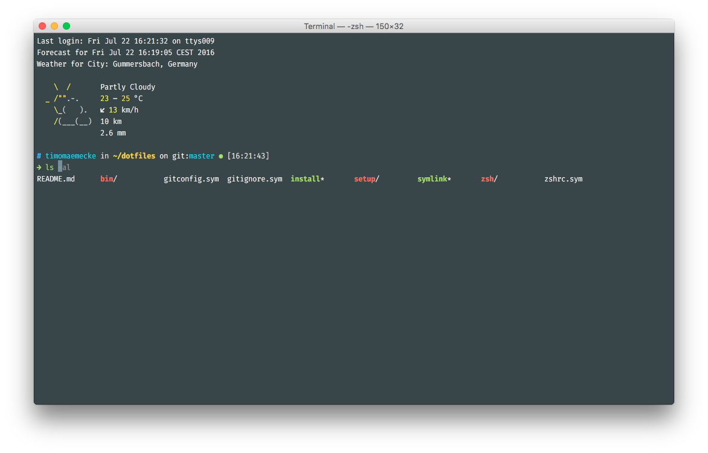

# .{files}

## how

`./install` will install everything and link the dotfiles (and other files)

`./symlink` will only link the dotfiles (and other files)

## what

- gitstuff
- zsh configurations
  - w/ plugins via [antibody](https://github.com/getantibody/antibody)
    - [alias-tips](https://github.com/djui/alias-tips)
    - [nvm-auto-use](https://github.com/tomsquest/nvm-auto-use.zsh)
    - [enhancd](https://github.com/b4b4r07/enhancd)
    - [cdbk](https://github.com/MikeDacre/cdbk)
    - [zsh-completions](https://github.com/zsh-users/zsh-completions)
    - [zsh-autosuggestions](https://github.com/zsh-users/zsh-autosuggestions)
    - [zsh-syntax-highlighting](https://github.com/zsh-users/zsh-syntax-highlighting)
  - fancy prompt w/
    - status code indicator
    - git status feat. emojis
    - it's in colorvision 🎨
  - awsum weather banner w/ cache and stuff
- macos configurations
- atom files
- setup for brew and nvm
- tmux (which i never use)
- vim (which i never use)
- a few bins 🗑
- custom color scheme for terminal.app
- [all by myself](https://youtu.be/EzoazPPC7b8?t=1m19s)

## why

because look at it~

